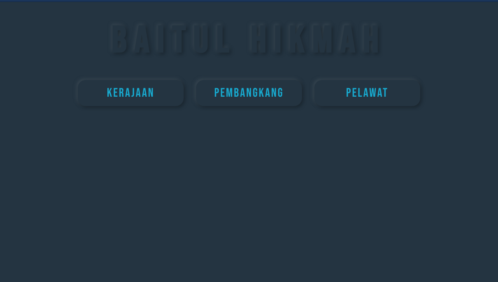
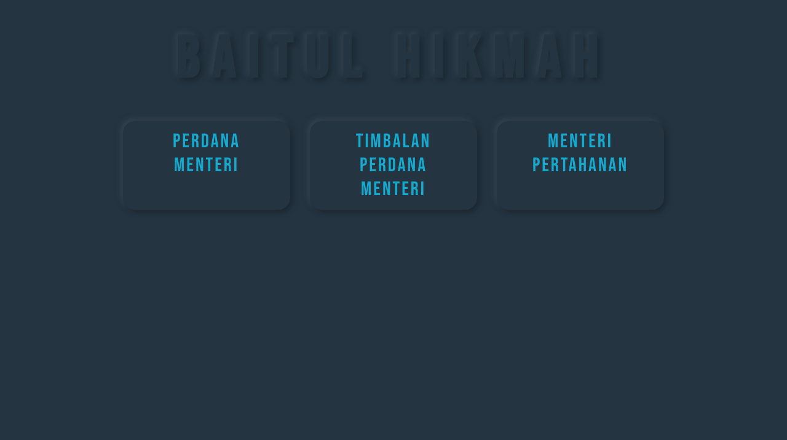
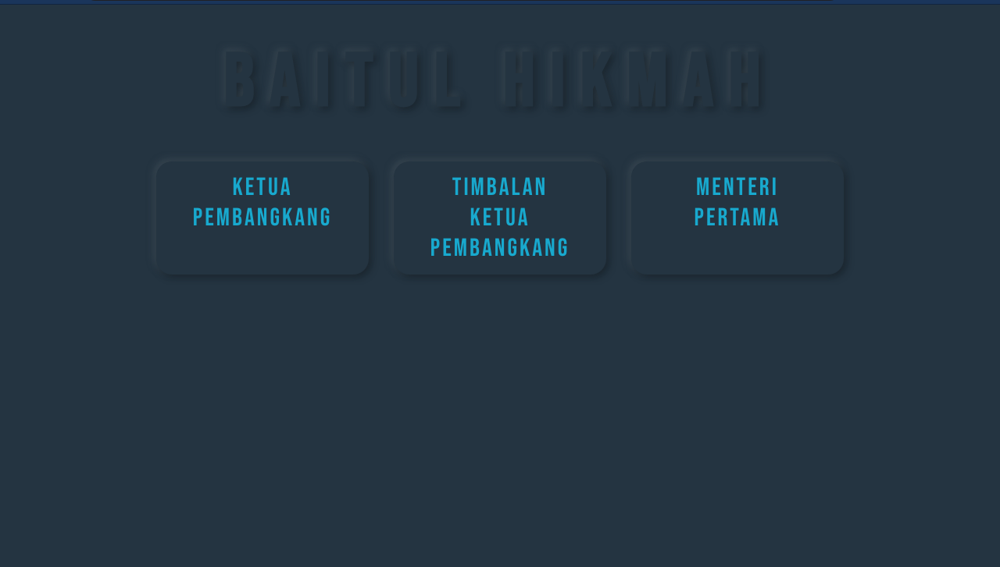
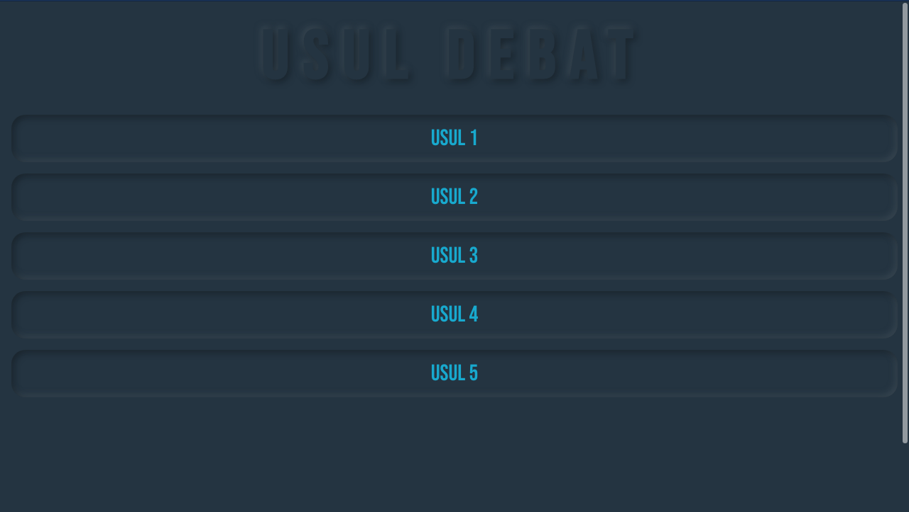

# Baitul Hikmah 

Baitul Hikmah is an implementation of Asian Parlimentary competition format with two teams format. 

## Overview 

## CSS Concept
Neumorphism 

## Web Flow
1. User can choose which side that he/she represented. It either kerajaan (goverment) or pembangkang (opposition)
.

2. After user has choose their side, user will have to choose which type of speakers they will representing.

3. If the user choose kerajaan (goverment), they have to choose between __Perdana Menteri__ that will act as first speaker for goverment side, __Timbalan Perdana Menteri__ that will act as second speaker for goverment side and __Menteri Pertahanan__ that will act as third speaker for goverment side.  

4. If the user choose pembangkang (opposition), they have to choose between __Ketua Pembangkang__ that will act as first speaker for opposition side, __Timbalan Ketua Pembangkang__ that will act as second speaker for opposition side and __Menteri Pertama__ that will act as third speaker for opposition side. 

5. The turn for each speaker:
    * Perdana Menteri
    * Ketua Pembangkang
    * Timbalan Perdana Menteri
    * Timbalan Ketua Pembangkang
    * Menteri Pertahanan
    * Menteri Pertama

## Contribution
Contributions are welcome and are greatly appreciated!